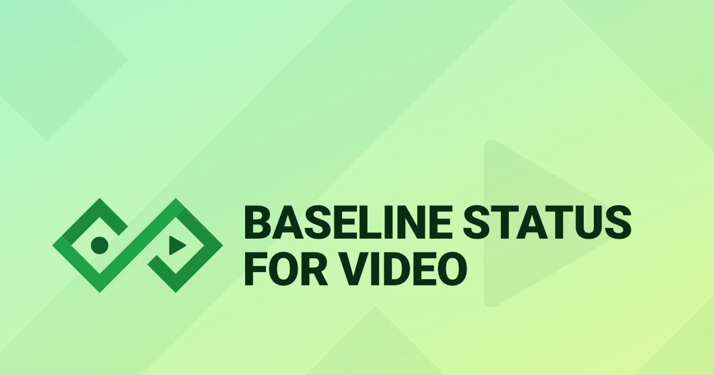

# Baseline Status for Video

A handy tool that will let you easily show Baseline Status in your videos.



## ✨ Features

- **Real-time Preview**: See your Baseline Status widget changes instantly
- **Customizable Styling**: Adjust colors, spacing, transitions, and more
- **Screen Recording**: Built-in screen capture with video download
- **Chroma Key Ready**: Dark red background optimized for green screen effects
- **Privacy First**: All recordings are local - nothing is uploaded or stored
- **Cross-browser Support**: Works best with Chrome, supports Safari and Firefox

## 🚀 Quick Start

### Prerequisites

- Node.js 18+
- npm, yarn, pnpm, or bun
- Google Chrome with screen recording permissions

### Installation

1. **Clone the repository**

   ```bash
   git clone https://github.com/ZoranJambor/baseline-status-for-video/
   ```

2. **Install dependencies**

   ```bash
   npm install
   # or
   yarn install
   # or
   pnpm install
   ```

3. **Start the development server**

   ```bash
   npm run dev
   # or
   yarn dev
   # or
   pnpm dev
   ```

4. **Open your browser**
   Navigate to [http://localhost:3000](http://localhost:3000)

## 📖 How to Use

1. **Customize Your Widget**

   - Use the sidebar controls to adjust Feature ID, colors, spacing, and transitions
   - Preview changes in real-time in the main area

2. **Record Your Screen**

   - Click the recording button to start screen capture
   - Grant screen recording permissions when prompted
   - The widget will appear for a few seconds during recording

3. **Download and Edit**
   - Download the recorded video file
   - Import into your video editing software
   - Use Chroma Key (Green Screen) to remove the dark red background
   - Use freeze frame to extend the widget display time

## 🛠️ Development

### Available Scripts

```bash
# Development
npm run dev          # Start development server
npm run build        # Build for production
npm run start        # Start production server

# Testing
npm run test          # Run tests in watch mode
npm run test:once     # Run tests once
npm run coverage      # Generate coverage report

# Code Quality
npm run lint          # Run Next.js lint
npm run stylelint     # Run Stylelint on CSS files
npm run stylelint:fix # Run Stylelint with auto-fix
npm run typecheck     # Run TypeScript type checking
```

### Project Structure

```
baseline-status-for-video/
├── app/               # Next.js app directory
│   ├── about/         # About page
│   ├── __tests__/     # App-level tests
│   └── globals.css    # Global styles
├── components/        # React components
│   ├── scene/         # Main video scene components
│   ├── sidebar/       # Configuration sidebar components
│   ├── ui/            # Reusable UI components
│   └── __tests__/     # Component tests
├── hooks/             # Custom React hooks
├── lib/               # Utility functions and configurations
└── public/            # Static assets
```

### Testing

The project uses Vitest for unit testing with comprehensive coverage:

Run tests with:

```bash
npm run test
```

## 🤝 Contributing

Contributions are most welcome! Here's how you can help:

### Getting Started

1. Fork the repository
2. Create a feature branch: `git checkout -b feature/amazing-feature`
3. Make your changes
4. Add tests for new functionality
5. Make sure all tests are passing: `npm run test:once`, `npm run lint:all`, `npm run stylelint`, `npm run typecheck`
6. Commit your changes: `git commit -m 'Add amazing feature'`
7. Push to the branch: `git push origin feature/amazing-feature`
8. Open a Pull Request

### Development Guidelines

- Follow the existing code style and conventions
- Write meaningful commit messages
- Add tests for new features
- Update documentation as needed
- Ensure all tests pass before submitting

## 🧰 Tech Stack

- **Framework**: [Next.js](https://nextjs.org/)
- **Language**: [TypeScript](https://www.typescriptlang.org/)
- **UI**: [Chakra UI](https://chakra-ui.com/)
- **Video Processing**: [FFmpeg.wasm](https://github.com/ffmpegwasm/ffmpeg.wasm)
- **Icons**: [`react-icons`](https://react-icons.github.io/react-icons/), [`@tabler/icons`](https://tabler.io/icons)
- **Testing**: [Vitest](https://vitest.dev/) for unit tests
- **Linting**: [Prettier](https://prettier.io/), [Stylelint](https://stylelint.io/), [ESLint](https://eslint.org/)

## 🔗 Links

- **Baseline Status for Video app**: [https://baseline-status-for-video.css-weekly.com](https://baseline-status-for-video.css-weekly.com)
- **Baseline website**: [https://web-platform-dx.github.io/web-features/](https://web-platform-dx.github.io/web-features/)
- **Baseline Status Web Component**: [https://github.com/web-platform-dx/baseline-status](https://github.com/web-platform-dx/baseline-status)
- **Feature ID list**: [https://github.com/web-platform-dx/web-features/tree/main/features](https://github.com/web-platform-dx/web-features/tree/main/features)

### 💝 Support the Project

- **Patreon**: [Support on Patreon](https://patreon.com/cssweekly)
- **Buy Me a Coffee**: [Support Development](https://buymeacoffee.com/cssweekly)
- **CSS Stickers**: [Get CSS Stickers Pack](https://stickers.css-weekly.com)
- **Courses**: [Mastering Linting Course](https://masteringlinting.com)

### 🌐 Social Media

- **YouTube**: [CSS Weekly](https://www.youtube.com/@CSSWeekly?sub_confirmation=1)
- **Bluesky**: [@cssweekly.com](https://bsky.app/profile/cssweekly.com)
- **X (Twitter)**: [@CSSWeekly](https://x.com/CSSWeekly)
- **CodePen**: [Zoran Jambor](https://codepen.io/ZoranJambor)
- **TikTok**: [@CSSWeekly](https://www.tiktok.com/@CSSWeekly)

## 📝 License

This project is licensed under the MIT License - see the [LICENSE](https://github.com/ZoranJambor/baseline-status-for-video?tab=MIT-1-ov-file) file for details.

---

Made with ❤️ by [Zoran Jambor](https://zoranjambor.com/), [CSS Weekly](https://css-weekly.com)
